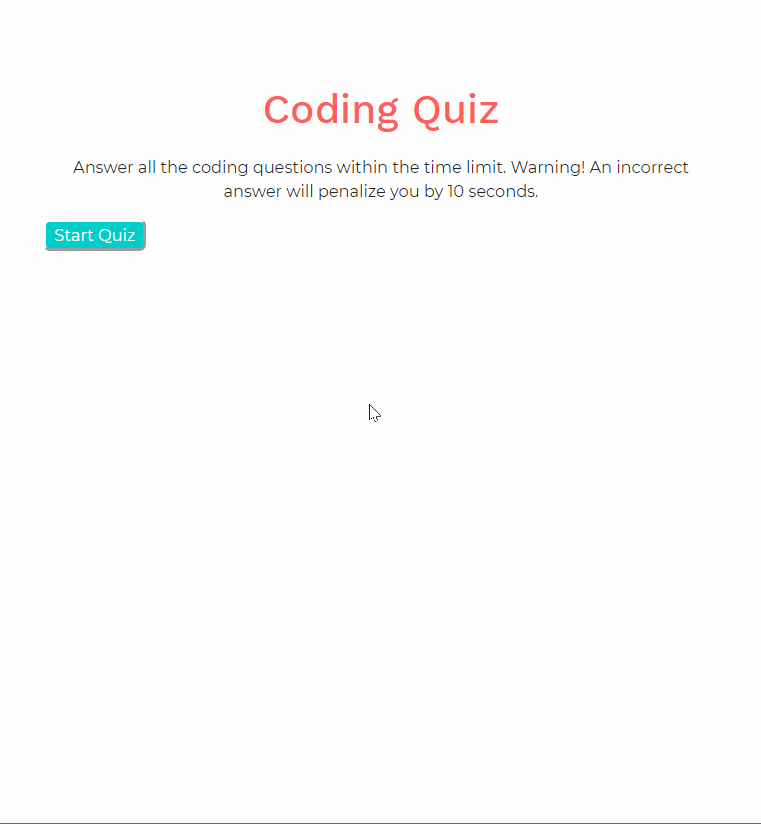

# Code Quiz

These assessments are typically a combination of multiple-choice questions and interactive challenges. In this homework assignment, your challenge is to build a code quiz with multiple-choice questions.

## Instructions

This is a timer-based code quiz application with multiple-choice questions that stores high scores client-side. 

## User Story
As a coding bootcamp student
I want to take a timed quiz on JavaScript fundamentals that stores high scores
so that I can gauge my progress compared to my peers

## Play proceeds as follows:

  * The user arrives at the landing page and is presented with a call-to-action to "Start Quiz." 

  * Clicking the "Start Quiz" button presents the user with a series of questions. The timer is initialized with a value and immediately begins countdown.

  * Score is calculated by time remaining. Answering quickly and correctly results in a higher score. Answering incorrectly results in a time penalty where time is subtracted from time remaining.

  * When time runs out and/or all questions are answered, the user is presented with their final score and asked to enter their initials. Their final score and initials are then stored in `localStorage`.

* Refer to the GIF below for an app demo.

https://fguzmanrs.github.io/4-codeQuiz/

## Future version to include: 

* audio files to alert the user of correct/incorrect answers
* users have multiple quizzes to choose from 
